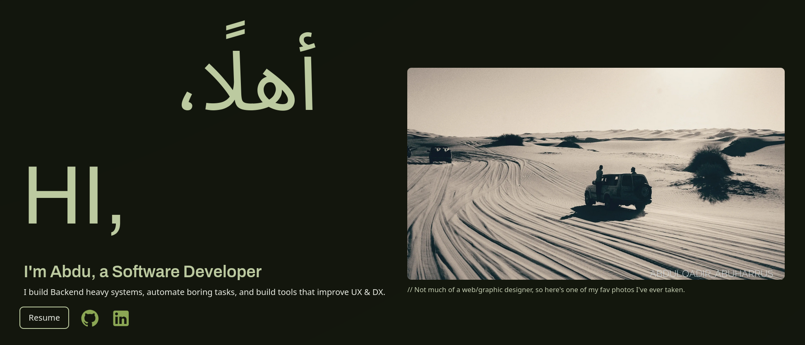
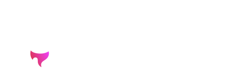

# aabuharrus.dev

I finally had time to build my nook on the web.
Since I'm a fan of fast static websites, I tried out Astro with Svelte "islands" for some dynamic client-side JavaScript.

Just like my personality, life, and skills, this website is an ever changing landscape, so updates and reboots are inevitable.
Today it's a simple page on the internet, but who knows what tomorrow might bring...👀
Later on when it grows and a need for dynamic components comes up, I might switch to React (Next.js) or Svelte (Sveltekit).

### References & Inspirations
There are countless inspirations going into this project from all over, but here are the stars:

1. Whoissajid ([YouTube](https://www.youtube.com/@whosajid) and [GitHub](https://github.com/whosajid)): his design ethos and informative videos have inspired me greatly when it comes to UI/UX.
2. [Iconify](https://icon-sets.iconify.design/) Wide variety of great and free icons that come in CSS, SVG, and more! 

# Built Using

---
All Rights Reserved Abdulqadir Abuharrus 2026

